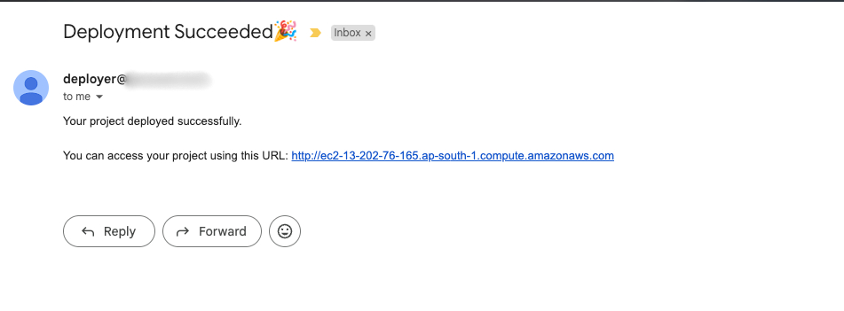
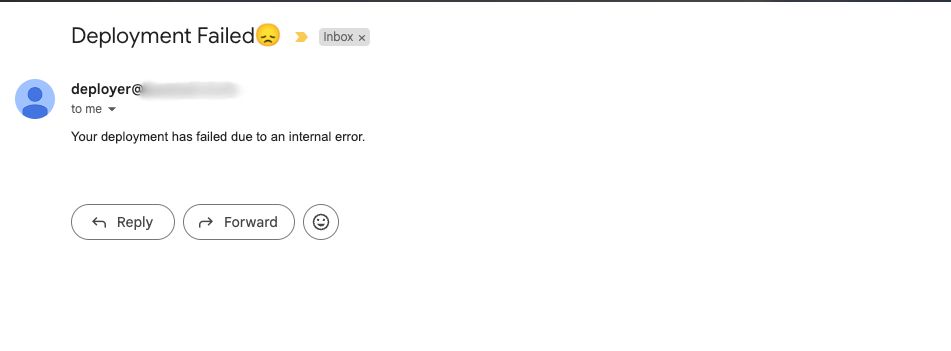
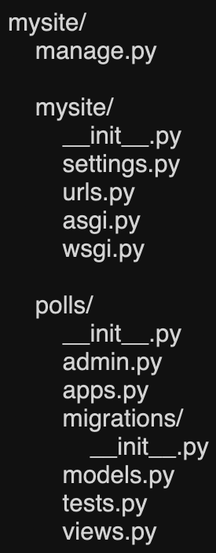

# Django Deployer

Django Deployer is a microservice-based application designed to enable users to deploy their Django applications on AWS with a single click. This project leverages various technologies, including Python, FastAPI, PostgreSQL, Redis, Docker, RabbitMQ, Celery, Terraform, Nginx and Boto3, to automate the deployment process.

## Features

### Admin Service

- **Instance Management:** Admins can add different instance types (e.g., t2.micro, t3a.small) and associate them with predefined plans (Low, Medium, High).
- **Plan Management:** Admins can create and update plans and associate them with instance types.
- **JWT Authentication:** Secure access to APIs, allowing only pre-configured admins to log in.
- **RabbitMQ Integration:** Facilitates sending plan and instance data to the User service via RPC calls.

### User Service

- **Plan and Instance Retrieval:** Provides users with a list of plans and instance types to choose from.
- **Deployment API:** Collects user details, **Public** GitHub repository link, selected plan, and instance details, then initiates the deployment process.
- **RabbitMQ Integration:** Retrieves plan and instance data from the Admin service and queues tasks for the Deployer service using RabbitMQ.

### Deployer Service

- **Task Processing:** Handles deployment tasks by processing user inputs, preparing the project for deployment, and uploading the necessary files to S3.
- **Terraform Execution:** Sets up the infrastructure based on the selected instance type and runs the required scripts to configure the instance.
- **Deployment Script:** Installs necessary software and libraries, downloads the project files from S3, and runs the application onto the instance.
- **Notification:** Sends an email to the user with the deployment status (success or failure) and the Public IPv4 DNS address if successful.  

## Usage

### Admin Operations

- **Manage Plans and Instances:** Admins can perform CRUD operations on plans and instances, including viewing the list, viewing details, adding, updating, and deleting plans and instances.
- **Interaction via REST API:** Admins interact with the Admin service via REST API calls.

### User Operations

- **Select Plan and Instance:** Users can choose from available plans and instance types.
- **Deploy Application:** Users can initiate the deployment process by providing their email, **Public** GitHub repository link, and selected plan details.
- **Interaction via REST API:** Users interact with the User service via REST API calls.

### Deployer Operations

- **Automated Deployment:** The service processes the deployment tasks, sets up the infrastructure, and deploys the application on AWS.
- **Internal Service:** Only the User service interacts with the Deployer service internally; End users cannot directly interact with the Deployer service.

## Future Enhancements

- Database Integration.
- Environment Variable Support.
- SSL/TLS and HTTPS Integration.
- UI for interacting with admin and user service APIs.

## Getting Started

**Pre-requisites:**

- [Docker](https://www.docker.com/products/docker-desktop/)
- AWS Account with necessary permissions for Terraform.
- A verified domain should be added on AWS SES.
- And, S3 Bucket for storing codebase files.

**Few Caveats:**

- The project you need to deployed should be available on GitHub and should be a public repository.
- The project structure should look like this: 

**Start/Stop the services:**

1. Clone the project repository to your local machine.

2. Open a terminal and navigate to the project directory.

3. Run `make up` to start all the services.

4. To stop the services, Run `make down`.

